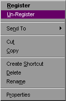



## A slick new way to Register your DLLs with ease\!\!

### Description

Tired of dealing with Regsvr32 and users who don't even know what a DLL is? This code will make it easy to Register and Un-register your VB DLLs by adding menu options to Windows when you right-click on a DLL or OCX. Additionally, when you double-click on any DLL or OCX file, Windows will automatically Register it by default. Supporting your DLLs just got easier! Please leave your comments and Please Vote!
 
### More Info
 

             |
---                |---
**Submitted On**   |2000-12-01 11:03:40
**By**             |[David Drake](https://github.com/Planet-Source-Code/PSCIndex/blob/master/ByAuthor/david-drake.md)
**Level**          |Advanced
**User Rating**    |4.8 (110 globes from 23 users)
**Compatibility**  |VB 3\.0, VB 4\.0 \(16\-bit\), VB 4\.0 \(32\-bit\), VB 5\.0, VB 6\.0
**Category**       |[Registry](https://github.com/Planet-Source-Code/PSCIndex/blob/master/ByCategory/registry__1-36.md)
**World**          |[Visual Basic](https://github.com/Planet-Source-Code/PSCIndex/blob/master/ByWorld/visual-basic.md)
**Archive File**   |[CODE\_UPLOAD122361212000\.zip](https://github.com/Planet-Source-Code/david-drake-a-slick-new-way-to-register-your-dlls-with-ease__1-13246/archive/master.zip)

